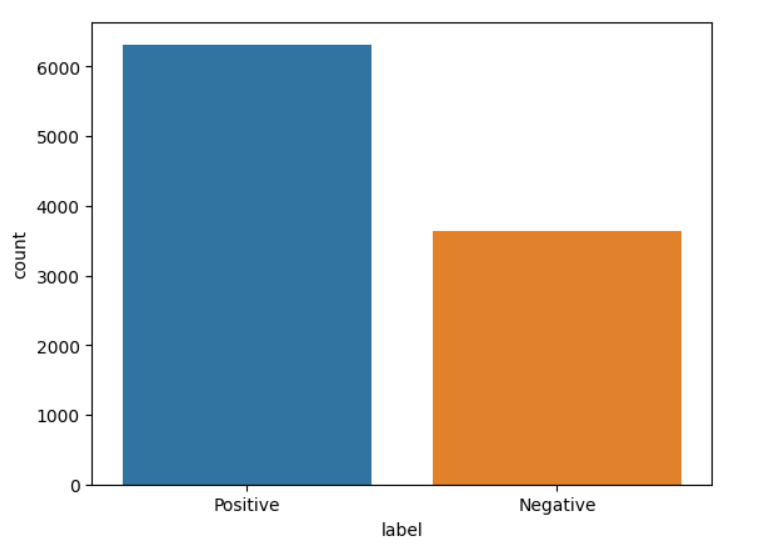

# restaurant-review-prediction

### Студент - Расковалова Алёна
### Группа - P4141

#### Цель
Повышение точности предсказания при оценке настроения в отзывах на рестораны.

#### Задачи
1. Сбор данных
2. Спроектировать архитектуру системы
2. Обучить модели на основе обучающей выборки
3. Выполнить оценку моделей на тестовой выборке
4. Выбрать оптимальную модель
5. Развернуть лучшую модель

#### Датасет

Ссылка на датасета: https://www.kaggle.com/datasets/joebeachcapital/restaurant-reviews?datasetId=3697155&sortBy=voteCount  

Оценка содержимого исходного датасета: 

№  | Column     | Non-Null Count | Dtype  
---|------------|----------------|-------  
 0 | Restaurant | 10000 non-null | object 
 1 | Reviewer   | 9962 non-null  | object 
 2 | Review     | 9955 non-null  | object 
 3 | Rating     | 9962 non-null  | object 
 4 | Metadata   | 9962 non-null  | object 
 5 | Time       | 9962 non-null  | object 
 6 | Pictures   | 10000 non-null | int64  
 7 | 7514       | 1 non-null     | float64

dtypes: float64(1), int64(1), object(6)

Доля позитивных и негативных отзывов

Необходимо будет удалить строки с нулевыми значениями и повторяющимися данными. Получится 9955 записей

#### Диаграмма активности

#### Диаграмма компонентов

